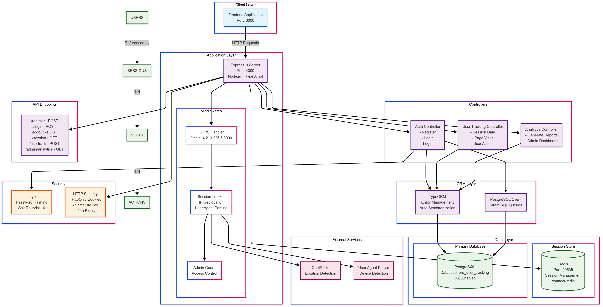

# OLDPhones - Used Smartphone Marketplace

A comprehensive full-stack marketplace for buying and selling used smartphones with **built-in user analytics and behavioral tracking**. 

## 🚀 Deployment
- Frontend deployed at : [http://4.213.225.5:3000/](http://4.213.225.5:3000/)
- Server deployed at : [http://4.213.225.5:4000/](http://4.213.225.5:4000/)
## Architecture Diagram

## 🚀 Features

### User Management & Authentication
- **User Registration & Login** - Secure authentication with bcrypt password hashing
- **Session Management** - Redis-based session storage with automatic tracking
- **Admin Access** - Special admin privileges for analytics and management
- **User Profiles** - Personal account management

### Advanced Analytics & Tracking
- **User Behaviour Tracking** - Comprehensive behavioral analytics including:
  - Page visit tracking with time spent analysis
  - Click event monitoring and element interaction
  - Session duration and user journey mapping
  - Device, browser, and OS detection
  - IP geolocation and user demographics
- **Admin Analytics Dashboard** - Detailed reports featuring:
  - Total unique user visits and engagement metrics
  - Top 10 most visited pages and user flow analysis
  - Average time spent per page
  - Popular devices and device category breakdown
  - Most clicked elements and interaction heatmaps
  - Logged-in vs anonymous user statistics
  - Average sessions per user and retention metrics

## 🛠️ Tech Stack

### Frontend
- **Framework**: Next.js 
- **Language**: TypeScript
- **Styling**: Tailwind CSS 
- **Components**: Radix UI primitives
- **Icons**: Lucide React
- **State Management**: React Context API
- **Notifications**: Sonner toast notifications

### Backend
- **Runtime**: Node.js with Express.js
- **Language**: TypeScript
- **Database**: PostgreSQL with TypeORM
- **Session Store**: Redis
- **Authentication**: bcrypt password hashing
- **Analytics**: Custom tracking system
- **Additional Libraries**:
  - `geoip-lite` - IP geolocation services
  - `useragent` - User agent parsing and device detection
  - `express-session` - Session management

## 📋 Prerequisites

- Node.js (v18 or higher)
- PostgreSQL database
- Redis server
- npm or yarn package manager

## ⚙️ Installation

### Backend Setup

1. **Navigate to server directory**
   ```bash
   cd server
   ```

2. **Install backend dependencies**
   ```bash
   npm install
   ```

3. **Environment Configuration**
   Create a `.env` file in the server directory:
   ```env
   # PostgreSQL Configuration
   POSTGRES_USER=your_postgres_user
   POSTGRES_PASS=your_postgres_password
   PG_HOST=your_postgres_host
   PG_PORT=5432
   PG_URI=your_complete_postgres_uri

   # Redis Configuration
   REDIS_URL=your_redis_host
   REDIS_PASSWORD=your_redis_password

   # Server Configuration
   PORT=4000
   ```

4. **Database Setup**
   ```bash
   # Ensure PostgreSQL is running
   # Create database: oru_user_tracking
   # TypeORM will auto-create tables
   ```

### Frontend Setup

1. **Navigate to client directory**
   ```bash
   cd client  # or root directory if frontend is in root
   ```

2. **Install frontend dependencies**
   ```bash
   npm install
   ```

3. **Environment Configuration**
   Create a `.env.local` file:
   ```env
   NEXT_PUBLIC_BASE_URL=http://localhost:4000
   ```

### Running the Application

1. **Start the backend server**
   ```bash
   cd server
   npm run build
   npm start
   ```

2. **Start the frontend development server**
   ```bash
   cd client
   npm run dev
   ```

3. **Access the application**
   - Frontend: `http://localhost:3000`
   - Backend API: `http://localhost:4000`

## 🗄️ Database Schema

### User Management
- **users** - User accounts with authentication data
- **user_session_data** - Session tracking with device and location info

### Analytics & Tracking
- **user_visits** - Page visit records with engagement metrics
- **visit_actions** - User interaction and click event logging

## 📱 Application Structure

### Frontend Pages
```
/                           # Homepage with featured deals
/bestdeals                  # Product listings with filters
/bestdeals/product/[model]  # Individual product details
/login                      # User authentication
/register                   # User registration
/admin                      # Analytics dashboard (admin only)
```

### Backend API Endpoints

#### Authentication
- `POST /register` - User registration
- `POST /login` - User authentication
- `POST /logout` - Session termination

#### User Tracking
- `GET /session` - Current session information
- `POST /usertrack` - Submit tracking data

#### Admin Analytics
- `GET /admin/analytics` - Comprehensive analytics report
  - Query Parameters: `startDate`, `endDate`

## 📊 Analytics Dashboard

The admin dashboard provides comprehensive insights including:

```json
{
  "totalUniqueVisits": 1234,
  "topPages": [
    { "pageUrl": "/bestdeals", "visitCount": "500" },
    { "pageUrl": "/", "visitCount": "400" }
  ],
  "avgTimeSpent": [
    { "pageUrl": "/bestdeals/product/iphone-12", "avgTime": "120.5" }
  ],
  "topDevices": [
    { "device": "iPhone", "count": "300" },
    { "device": "Samsung Galaxy", "count": "250" }
  ],
  "topClickedElements": [
    { "element": "product-card", "clicks": "450" },
    { "element": "filter-button", "clicks": "320" }
  ],
  "deviceCategories": [
    { "category": "Apple", "count": 400 },
    { "category": "Samsung", "count": 300 }
  ],
  "loggedStatusStats": [
    { "isLoggedIn": true, "count": "600" },
    { "isLoggedIn": false, "count": "634" }
  ],
  "avgSessionsPerUser": 2.8
}
```

## 🔐 Security Features

- **Password Security**: bcrypt hashing with 10 salt rounds
- **Session Protection**: HTTP-only cookies with SameSite protection
- **Admin Authorization**: Middleware-based route protection
- **Input Validation**: Comprehensive request validation
- **CORS Configuration**: Secure cross-origin requests


## 📁 Project Structure

```
oldphones-marketplace/
├── server/                    # Backend application
│   ├── controller/           # Route controllers
│   │   ├── adminController.ts    # Analytics and reporting
│   │   ├── authController.ts     # User authentication
│   │   └── userTracking.ts       # Behavioral tracking
│   ├── db/                   # Database configuration
│   │   ├── entities/             # TypeORM entity definitions
│   │   ├── connectToDB.ts        # PostgreSQL connection
│   │   └── typeorm.ts           # ORM configuration
│   ├── middlewares/          # Express middlewares
│   │   ├── admin.ts             # Admin access control
│   │   └── sessionTracker.ts    # Session and device tracking
│   ├── routes/              # API route definitions
│   ├── types/               # TypeScript type definitions
│   └── server.ts           # Main server application
└── client/                   # Frontend application
    ├── src/
    │   ├── app/             # Next.js app router pages
    │   ├── components/      # Reusable UI components
    │   ├── context/         # React context providers
    │   ├── hooks/          # Custom React hooks
    │   └── lib/            # Utility functions
    └── package.json
```

## 🔧 Development

### Backend Development
- **TypeScript**: Full type safety with strict checking
- **Hot Reload**: Use `ts-node` for development
- **Database Sync**: Automatic schema synchronization

### Frontend Development
- **Next.js**: App router with server components
- **TypeScript**: Strict type checking enabled
- **Tailwind CSS**: Utility-first styling approach
- **Component Library**: Radix UI primitives


## 📄 License

This project is licensed under the ISC License.

## 🤝 Support

For support and questions, please open an issue in the GitHub repository.

---

**OLDPhones** - Revolutionizing the second-hand smartphone market with data-driven insights and seamless user experience.
